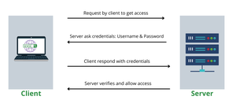

<h1 align="center">📦 Personal Data & Basic Auth Project</h1>

    

    <strong>Sécurisation des données personnelles & Authentification basique</strong> 
    <em>Un projet pédagogique pour comprendre et implémenter les bases de la sécurité backend</em>

---

## 📚 Description

Ce projet met l’accent sur la **gestion sécurisée des données personnelles** (PII - *Personally Identifiable Information*) et l’implémentation d’un mécanisme d’**authentification basique** à travers une API Python avec Flask.

Il comprend :

- 🛡️ L’obfuscation des données sensibles dans les logs (mots de passe, SSN, etc.)
- 🔍 L’utilisation de filtres personnalisés avec `logging.Filter`
- 🔐 Le hachage et la validation de mots de passe avec `bcrypt`
- 🌿 L'utilisation sécurisée des variables d’environnement pour l’authentification
- 🔑 L’implémentation de l’authentification Basic en respectant la norme HTTP (Base64)
- 📜 Le respect strict des standards Python : PEP8, docstrings, et typage complet

---

## 🧠 Objectifs pédagogiques

- Identifier et comprendre les différents types de PII
- Protéger les informations sensibles dans les journaux systèmes
- Maîtriser les expressions régulières pour anonymiser les données
- Implémenter un filtre de logs personnalisé
- Hacher et valider des mots de passe de manière sécurisée avec `bcrypt`
- Gérer les variables d’environnement en toute sécurité
- Comprendre le mécanisme d’authentification Basic et son usage dans les APIs REST
- Manipuler l’en-tête HTTP `Authorization`
- Encoder et décoder des chaînes avec Base64 en Python

---

## ⚙️ Technologies utilisées

- Python 3.9 (Ubuntu 20.04)
- Flask
- bcrypt
- Base64
- Logging
- Regex
- dotenv (`python-dotenv`)

---

## ✅ Requis du projet

- Tous les fichiers sont exécutables (`chmod +x`)
- Fin de ligne à la fin de chaque fichier
- Conformité avec PEP8 (`pycodestyle` 2.5)
- Documentation complète :
  - Chaque module
  - Chaque classe
  - Chaque fonction (avec explication claire du but)
- Typage strict sur toutes les fonctions
- README propre et informatif

---

## 👨‍💻 Author

**Haris** – Full-Stack Web Developer  
GitHub: [@harishammache](https://github.com/harishammache)
