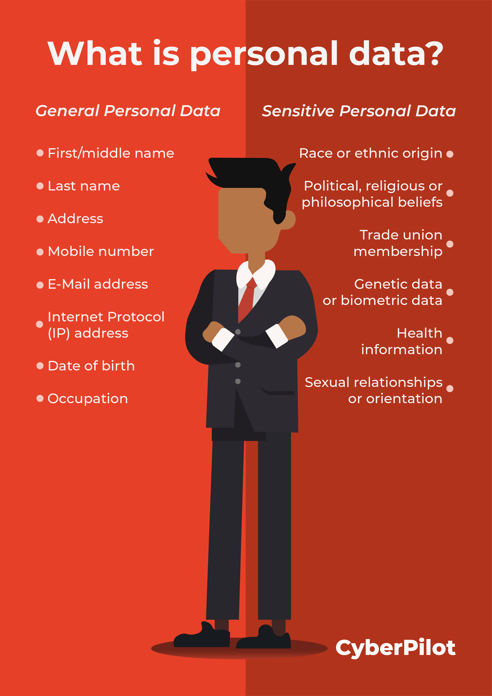

<h1 align="center">📦 Personal Data Project</h1>

    

## 📚 Description

This project focuses on managing and protecting **Personally Identifiable Information (PII)** within a backend system written in Python.

It covers:
- Obfuscation of sensitive data in logs (e.g. passwords, SSNs)
- Implementation of secure log filtering with `logging.Filter`
- Password hashing and validation using `bcrypt`
- Secure database authentication via environment variables
- Best practices in privacy and security for backend development

---

## 🧠 Learning Objectives

- Identify and understand different types of PII
- Use regular expressions to redact sensitive fields from logs
- Create and apply custom logging filters
- Encrypt and verify passwords securely
- Safely manage credentials using environment variables
- Follow strict Python documentation and type annotation standards

---

## 🛡️ Requirements

- Python 3.9 (Ubuntu 20.04)
- All files are executable and end with a new line
- Compliant with PEP8 (`pycodestyle` 2.5)
- Each module, class, and function is documented with a clear docstring
- Full type annotations across all functions

---

## 📄 License

For educational use only. Project property of Holberton School.

---

## 👨‍💻 Author

**Haris** – Full-Stack Web Developer  
GitHub: [@harishammache](https://github.com/harishammache)

