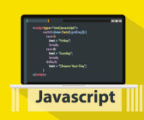

<h1 align="center">🧪 Unit Tests in JS - Tests automatisés avec Mocha, Chai & Sinon</h1>

<div align="center">
    
</div>

---

## 📖 Introduction

Les **tests unitaires** sont une étape essentielle dans le développement d’applications robustes et maintenables.  
Ce projet t’apprend à écrire, organiser et exécuter des tests en **JavaScript** avec **Mocha**, **Chai** et **Sinon**.  

Tu vas apprendre à :  
- Construire une **suite de tests** avec **Mocha**  
- Utiliser différentes **bibliothèques d’assertions** (Node.js natif & Chai)  
- Écrire des tests pour des **fonctions synchrones et asynchrones**  
- Utiliser des **spies** et **stubs** pour simuler des comportements  
- Tester des **endpoints Express** avec des requêtes HTTP  

---

## 🧠 Concepts clés

### ✅ Tests unitaires
- Vérifient une **fonctionnalité précise** d’une application  
- Facilitent la **maintenance** et la **détection des bugs**  

### 🧪 Mocha
- Framework de test flexible  
- Permet d’écrire et d’exécuter des suites de tests  

### 🔎 Chai
- Librairie d’assertions riche (`expect`, `should`, `assert`)  
- Rend les tests plus **expressifs et lisibles**  

### 👁️ Sinon
- Fournit des **spies, stubs et mocks**  
- Idéal pour tester des fonctions dépendantes d’autres modules ou API  

### 🌐 Tests d’intégration
- Permettent de tester un **mini serveur Express**  
- Vérifient le bon fonctionnement des routes via des requêtes HTTP  

---

## 🧰 Technologies & Librairies

- `Node.js 20.x`  
- `Mocha` : framework de test  
- `Chai` : assertions  
- `Sinon` : mocks, spies & stubs  
- `Express` : mini serveur pour tests d’intégration  
- `Request` : envoi de requêtes HTTP  

---

## ⚙️ Exécution des tests

Lancer tous les tests avec :  

```bash
npm run test *.test.js
```

## 🧼 Bonnes pratiques

✅ Organiser les tests dans un dossier `test/` clair  
✅ Nommer les fichiers avec le suffixe `.test.js`  
✅ Utiliser des **hooks** (`before`, `after`, `beforeEach`, `afterEach`) pour préparer et nettoyer les tests  
✅ Isoler chaque test : **un test = un comportement précis**  
✅ Respecter la **conformité ESLint** et la cohérence du code  

---

## 🎯 Objectifs pédagogiques

À la fin de ce projet, tu seras capable de :  
- 📦 Créer et exécuter une suite de tests avec Mocha  
- 🧩 Utiliser différentes stratégies d’assertion (Node.js vs Chai)  
- 🔄 Gérer les fonctions asynchrones dans les tests  
- 🕵️ Employer **spies** et **stubs** efficacement  
- 🌐 Tester des endpoints d’un serveur Express  

---

## 🧑‍💻 Auteur

Hammache Haris  
🔗 [GitHub - harishammache](https://github.com/harishammache)

---